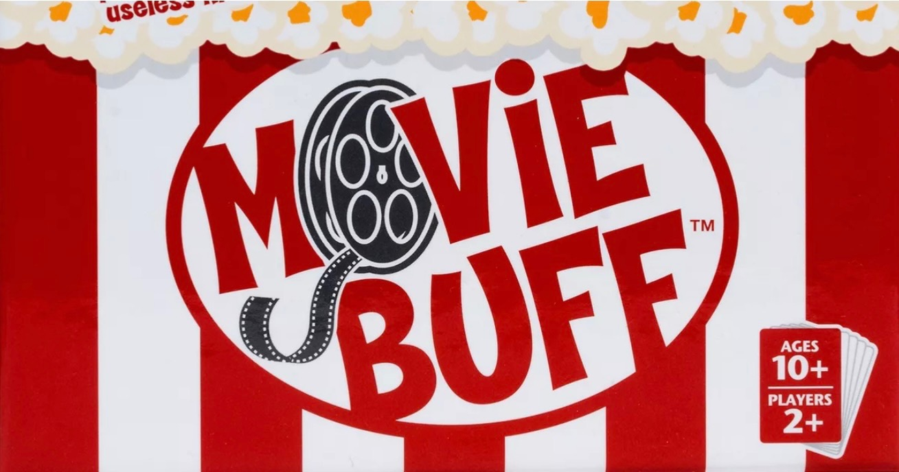

# Movie Buff

## Logo:

## GitHub repository link:
[Cinema_club](https://github.com/2000Bel/Cinema_club.git)

## trello link:
[Planning board](https://github.com/2000Bel/Cinema_club.git)

## Deployed app link:
[MovieBuff]()

## Project Explanation:
Movie Buff is a full-stack Django web application designed for film enthusiasts to create and manage their personal movie catalog. The app allows registered users to organize, explore, and keep track of movies and the actors who star in them. It supports full CRUD (Create, Read, Update, Delete) functionality and incorporates user authentication and authorization to ensure that only the data owner can modify or delete content.

>## Technologies Used:
>>Key Features
	•	User Authentication: Secure session-based login system using Django’s built-in authentication.
	•	Movie Management: Users can add, edit, view, and delete movies in their personal collection.
	•	Actor Database: Users can add actors and link them to multiple movies through a many-to-many relationship.
	•	Authorization: Only the user who created a movie or actor can modify or delete it. Guests cannot access creation or editing functionality.
	•	Media and Design: Users can upload posters for each movie. The interface features a modern layout, responsive design, and consistent visual theme.
	•	Pre-filled Forms: When editing any movie or actor, the form comes pre-populated with current data for a seamless user experience.
	•	Accessibility & UI: The app follows accessibility standards with readable contrast, alt text for images, and styled buttons throughout.

>>Tech Stack
	•	Backend: Django, Python, PostgreSQL
	•	Frontend: HTML, CSS, Django Templates
	•	Authentication: Django Sessions
	•	Deployment: [Deployment platform, e.g., Render or Heroku]
	•	Version Control: Git & GitHub

## Next steps: 
1. Include a calendar to be able to date each task
2. Include more images
3. Include a trash can to store deleted tasks

# Django CRUD App Project - Evaluation Checklist

## Technical Requirements - MVP

| Requirement                                                                                                         | Complete? |
|---------------------------------------------------------------------------------------------------------------------|-----------|
| The app utilizes Django templates for rendering templates to users.                                                 | [ ]       |
| PostgreSQL is used as the database management system.                                                               | [ ]       |
| The app uses Django's built-in session-based authentication.                                                        | [ ]       |
| Authorization is implemented in the app.                                                                            | [ ]       |
| Guest users cannot create, update, or delete data or access those features.                                         | [ ]       |
| The project has at least one data entity in addition to the User model.                                             | [ ]       |
| At least one entity has a relationship with the User model.                                                         | [ ]       |
| The project has full CRUD functionality.                                                                            | [ ]       |
| The project is deployed online.                                                                                     | [ ]       |

## Code Convention Requirements

| Requirement                                                                                                         | Complete? |
|---------------------------------------------------------------------------------------------------------------------|-----------|
| Files are organized following project conventions.                                                                  | [ ]       |
| Code follows naming conventions (e.g. plural for lists).                                                            | [ ]       |
| No dead code, commented-out sections, or print statements in production.                                            | [ ]       |
| The app runs without errors in terminal and browser console.                                                        | [ ]       |
| Code is properly indented and formatted.                                                                            | [ ]       |

## UI/UX Requirements

| Requirement                                                                                                         | Complete? |
|---------------------------------------------------------------------------------------------------------------------|-----------|
| Consistent visual theme (color palette, layout).                                                                    | [ ]       |
| App is easily navigable through links.                                                                              | [ ]       |
| Uses CSS Flexbox and/or Grid for layout.                                                                            | [ ]       |
| Colors meet WCAG 2.0 level AA contrast standards.                                                                   | [ ]       |
| Forms are pre-filled with item data when editing.                                                                   | [ ]       |
| Only the data creator can edit or delete that data.                                                                 | [ ]       |
| All images have alt text.                                                                                           | [ ]       |
| No inaccessible text over images.                                                                                   | [ ]       |
| All buttons are styled.                                                                                             | [ ]       |
 
## Git and GitHub Requirements

| Requirement                                                                                                         | Complete? |
|---------------------------------------------------------------------------------------------------------------------|-----------|
| You are the only contributor on GitHub.                                                                             | [ ]       |
| Repo has an appropriate name (e.g. book-binder, wellness-tracker).                                                  | [ ]       |
| Repo is public on your personal GitHub account.                                                                     | [ ]       |
| Repo shows commit history from the start of the project.                                                            | [ ]       |
| Commit messages are descriptive.                                                                                    | [ ]       |

## README Requirements

| Requirement                                                                                                         | Complete? |
|---------------------------------------------------------------------------------------------------------------------|-----------|
| Screenshot or logo included.                                                                                        | [ ]       |
| App name and description are provided.                                                                              | [ ]       |
| Background info and motivation (optional but encouraged).                                                           | [ ]       |
| Getting Started section with links to deployed app and planning materials.                                          | [ ]       |
| Attributions included (or marked as not applicable).                                                                | [ ]       |
| Technologies used listed.                                                                                           | [ ]       |
| Next steps/future features listed.                                                                                  | [ ]       |

## Presentation Requirements

| Requirement                                                                                                         | Complete? |
|---------------------------------------------------------------------------------------------------------------------|-----------|
| Presented on scheduled day.                                                                                         | [ ]       |
| Project presented is the one approved by instructor.                                                                | [ ]       |

## Summary

| Project meets minimum requirements and passes.                                                                      | [ ]       |